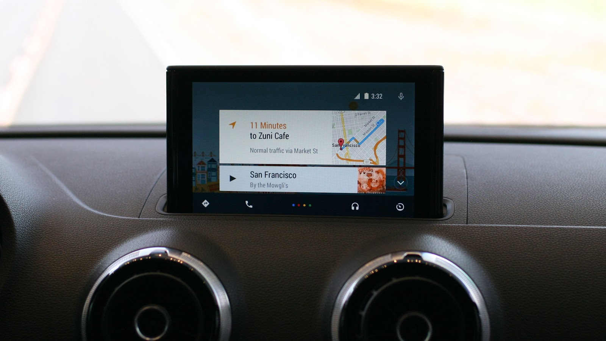
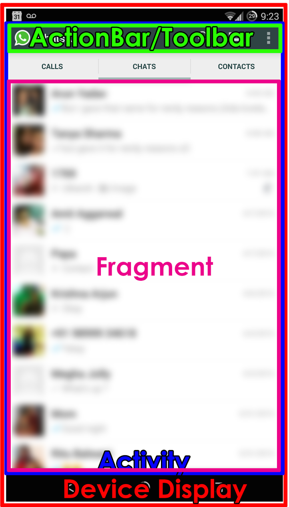
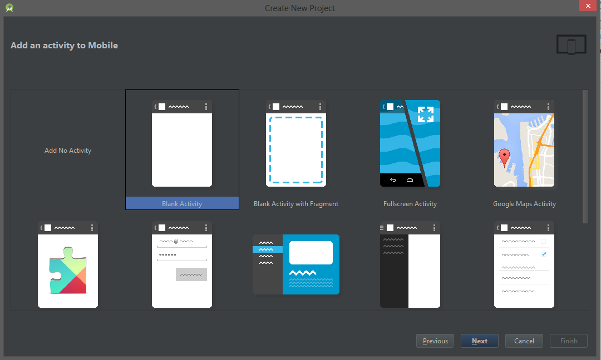
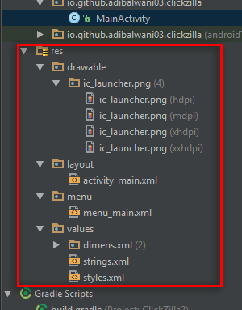
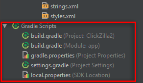
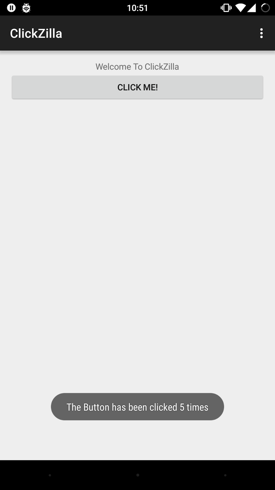
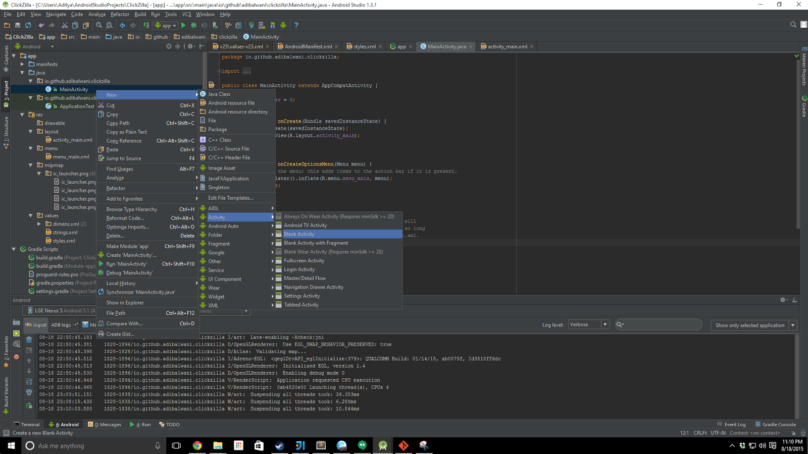
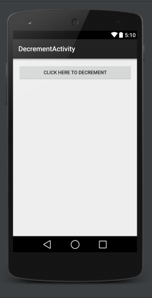
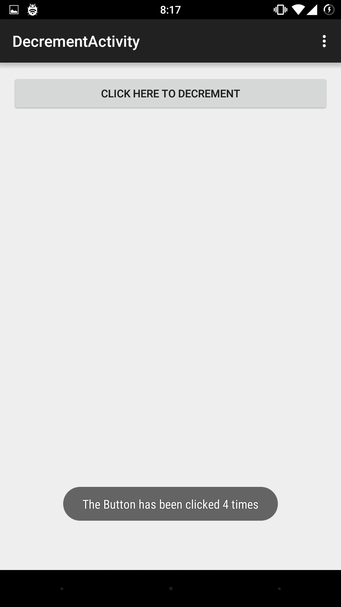
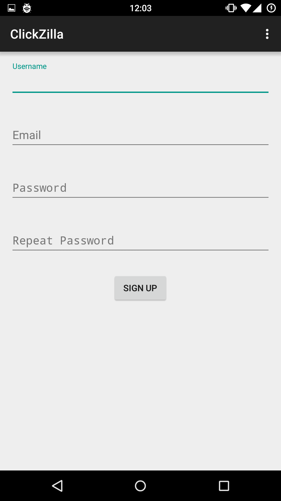

# Intro To Android Programming

## Intro

### What is Android?
Android is a Linux Kernel based operating system developed by Google. 
It originally started as a mobile OS, but has now expanded to:

#### Android TV


#### Android Wear


#### Android Auto



### Why Android?

* Thousands of Unique devices supported
* Written in Java 
* Amazing IDE
* Play store is more lax.
* Well documented 

### Getting Started
Development in android is done in Android Studio, a Google developed IDE that makes working on Android simple and fun! You should go ahead and snag the IDE [online](https://developer.android.com/sdk/index.html), or ask your local organizer for a preloaded thumb drive.

### Resources
* [Android Developer Guides](https://developer.android.com/guide/index.html)
* [Android Developer Training](https://developer.android.com/training/index.html)
* [Tutorials on various topics](http://www.androidhive.info/)
* Google is your friend! :D
* Stackoverflow is God!

### Basic Structure of an App

{:class='short'}


### What do these words mean?

* Activity
    - Activities are the basic building blocks of your 
    - Each screen in your app would be an activity
* Actionbar/Toolbar
    - The toolbar at the top is known as the ActionBar (Renamed to Toolbar in Lollipop)
    - It is optional, but useful
    - Usually contains frequently needed actions and options menu
* Fragment
    - Fragments are subsets of activities
    - Multiple fragments in one activity
    - Can be moved around to create Tabbed Layouts or NavDrawer Layouts

### Lets start the tutorial

So, today we’ll be making an app called clickzilla which introduces you to making a basic activity, layout and using intents and also using the options menu.
Here’s the completed code for this project for reference
https://github.com/adibalwani03/ClickZilla

### Create a New Project

* Lets create a new Project
* On the next screen you'll be prompted for the following
    - Name
    - Package Name
    You can name these anything you want. I called the app ClickZilla and and the general convention for package name is com.&lt;yourhandle&gt;.&lt;appname&gt;


### Support

You can support as many systems as you want. 
I tend to prefer supporting anything Android 4.0 or above. 

Android 2.3 is now dead, so no need to support that and android 3.0 is just plain weird so I like to pretend that never happened.

You can also add support for Google glass, TV and Wear if you want.


### Activity Templates

And now you’ll be taken to the templates screen which contain prebuild activities you can use. For this one, we will be sticking to a blank activity (or a blank with fragment) but you can choose anything you want (Except Login activity and preference acitivity, those are for specific purposes) 



### Activity Name

Now we give the activity a name.
Again, usual convention is that the first activity the app is called MainActivity
Or, if the app requires login then you can start at loginActivity or a DispatchActivity (which checks for already logged in users)
But these are just conventions so you don’t have to strictly follow them


### And now we wait

For a million years for gradle to get ready


Meanwhile...

### What is gradle?

Gradle is the build system that Android Studio uses to build all apps.
It is essentially a build automation system.
In your build.gradle file you can declare dependencies, signing configurations for APK signatures, flavors of the app (Such as specific builds for different versions of Android, or debug and release flavors)
Most of the time you will not need to make changes to build.gradle since Android Studio automates most of it (Automation for an Automation system, Yo Dawg!), but it is useful tool know to make certain things faster.
For example, if you define a signing config for your release version in gradle, all you need to do is run “$gradlew.bat assembleRelease” and it will generate a complete signed APK.

### Congratulations!!

You have completed your HelloWorld app.

Over the next few slides I’ll go over the automatically generated code and then  we’ll start making changes


{:class='wide'}


### File Structure

Here you can see the basic file structure of your app. Each folder here has a specific purpose which the following slides will explain.


#### Manifests

The Manifests directory is where you declare your AndroidManifest.xml and any other manifests.

The purpose of the manifest is to specify things for the device including declarations of all activities, all permissions required (eg. Internet, Wifi, I/O), special hardware requirements (camera, flash, gyro etc) and certain google APIs (eg. maps) and other things that can possibly affect compatibility. 

NOTE : Some of the tasks a manifest does is now also being done by the build.gradle such as declaring minimum android version

#### Java Packages

The java folder is where all your packages are declared, and inside those are all your java files. 
Most of your code would go in the main package. 

I personally have never used the AndroidTest package, so I can’t say much on that, but i’m guessing its for making test cases for the app (If someone knows, do tell me and will update the slides).


#### Res

The res folder is the real deal. This folder contains all the graphics+ui stuff of your app.



* Drawable
   This is where all images go. Real programmers create different sized of every image to reduce memory imprint on smaller devices, but i’m too lazy for that
* Layout
    This folder contains the xmls that define the layout of each activity
* Menu
    This folder stores all the menu options for various activities.
* Values
    This one contains all defined constants such as colors, themes, paddings, strings, ints etc
    Usually its a good idea to make another xmls that stores all your API keys and also add it to the .gitignore so you don’t end up accidentally committing them

#### Gradle

This is where all the gradle files reside. 
Usually you’ll only be making small changes to the build.gradle in the App Module
Other than that, its mostly left untouched


### Layouts

Now lets head over the activity_main.xml and you’ll probably be brought the design GUI. From the left pane you can drag and drop objects onto the screen and the layout xml will automatically change to add the new item. 
Easy peasy stuff, but often annoying. 
And so we move onto the actual XML -&gt;

#### activity_main.xml (text view)

So this XML is where your layout is defined.
Going through it line by line we have :

* &lt;RelativeLayout
    - This is the declaration of the layout, which in this case is Relative layout which means all objects are located in relation to a parent which is declared using android:layout_&lt;position&gt;=””
    - I find this to be one of the easiest ways to declare a layout.
    - Other popular layouts include LinearLayout, Frame, Grid and Table. You could also use ListView and ScrollView
    - ignore the xmlns:android line, this is essentially the include of your layout, declaring the format the xml will follow and things you can place inside. You only need to do this for the Root and is often auto-generated
* android:&lt;blah_blah&gt;
    - These are properties of whatever item is declared. Usually the name is fairly self explanatory and Android Studio has an amazing autocomplete system so you don’t need to remember the names of specific properies
* &lt;TextView
    - This is what currently holds your “HelloWorld” text. We’ll be changing it later.

#### MainActivity.java

The autogenerated java code. It contains the following things : 

* `public class MainActivity extends ActionBarActivity`
    - Declaration of your Activity and it inherits from ActionBarAcitivity (which in turn inherits from FragmentActivity which inhertis from Activity), which means you will have an Actionbar in your app and you can put Fragments in it too. 
    - You can change it to just Activity in which case it won’t have an actionbar or fragment support (which you don’t need for this one)
* `protected void onCreate(Bundle savedInstanceState)`
    - This method is automatically executed when this Activity is created. It is essentially your constructor.
    - setContentView(R.layout.activity_main);
        + This line of code is what “inflates” your activity, which essentially means it takes the layout you specified (in this case, activity_main.xml) and creates your activity to look like the specified layout
* `public boolean onCreateOptionsMenu(Menu menu)`
    - Similar to the previous method, this one inflates the OptionsMenu using the specified menu layout and is also called automatically
* `public boolean onOptionsItemSelected(MenuItem item) {`
    - This method is called when the user presses an item in the OptionsMenu and the clicked item is referenced by the item parameter.

### ClickZilla

So now we get to the actual coding. ClickZilla is a small app that introduces the following topics :

* Making changes to layouts and java files
* Displaying messages to the User
* Making new activities and linking to old one using Intents
* Adding items to the options menu and using them

## ClickZilla Part 1
Adding a button and Showing messages to users

### Modifying TextView

So lets start with adding a button to the activity_main.xml. You can remove the existing textview if you want, or you can keep it, i’ll be keeping it for now, but changing the text to “Welcome To ClickZilla”. Also, if you’re keeping it, add the following lines of code to the textview declaration : 

    android:id="@+id/welcome"
    android:layout_alignParentTop="true"
    android:layout_centerHorizontal="true"

IDs are given to views to refer to them in the program or for layout purposes and the layout_lines are specifying that its center aligned and that its at the top of the screen

### Adding a Button

Now, to add the button, add the following block of code inside the RelativeLayout : 
 
   
    <Button android:layout_width="match_parent"
        android:layout_height="wrap_content"
        android:id="@+id/click"
        android:text="Click Me!"
        android:layout_below="@id/welcome"
        android:onClick="buttonClicked"/>


ID and Text do the same things as before, whats new is specifying layout_width and layout_height. Setting them to “match_parent” sets to the same size as that of the parent, while setting it to “wrap_content” makes sure the size exactly fits everything inside
Another new thing is the layout_below, which tells the app that we want this button to be placed directly below whatever object has the id “welcome”
And finally onClick is the magical part of Button. Clicking on this button will automatically a method of the same name as that specified in the onClick field. Neat! :-D

### Layout Preview

At the end, if you go to your Design tab, your layout preview should look something like this


### Making the Button Do Work

Now that we have a button that calls “buttonClicked” we need to write that method. We also need to provide feedback to the User to show something happened when the button is clicked. 
The purpose of the ClickZilla is to count how many times the button was pressed. So lets make counter in the MainActivity class.
int clickCounter = 0;
To provide feedback we use an Android Library called Toast. Toasts a are small messages that fade in and out and are extremely useful for providing feedback. Now to create the method that reacts to the button press, add this to the MainActivity :

   
public void buttonClicked(View v) {
    clickCounter++;
    Toast.makeText(
        getApplicationContext(),
        "The Button has been clicked " + clickCounter + " times", 
        Toast.LENGTH_SHORT
    ).show();
}


Whats new is the argument View v. Anything in your android application is a View. TextView, Buttons, Radios all are children of View. So in this case, the argument is just a reference to which button was clicked. But we don’t need that for now. 
Toast.makeText is the method used to make Toasts. It takes in three arguments, the first one specifies where the toast is displayed, which in this case is the application context. The second is the message to be displayed and the third is the length. Finally, you need to call .show() to actually display the toast but luckily Android studio is nice enough to warn you if you ever forget :)

Fun Fact : Toasts are called toasts because originally they would pop in from the bottom like a toast coming out of toaster! 

### Time to test the App!

But wait.
How do I test my App?
There are 2 easy ways of doing this!

#### Method 1 : Android Debug Bridge

Android Debug Bridge aka ADB is a tool used to debug android applications (Surprise Surprise!). Of course you need an Android Device to do this.
To get started, you need to have the Google Drivers which you can install from the SDK Manager.
After that simply enable USB Debugging in your phone’s Developer options and connect it using USB and you’ll see a screen like this when you run the app. 


#### Method 2 : Android Emulator

If you don’t have an Android Device, fear not! Android Studio comes to the rescue! 
Android Studio comes with an Android Virtual Device (AVD) (Assuming you chose to install on during the installation). All you need is to chose Launch Emulator from the window displayed on the previous slide and your emulator would be ready in a few minutes.
If you chose not to install an AVD, you can create one right now using the AVD Manager though you may need to download the system images using the SDK Manager.
However, these virtual devices are usually slow, so you should only go for this method if you don’t have a compatible android device.
If you have performance issues with the AVD, try lowering some of its specs using the AVD Manager.

### YAY WE MADE SOMETHING

{:class='short'}


Now lets make more!

## ClickZilla Part 2

Creating another Activity and passing data back and forth. 

### Creating Another Activity

Now that we have an activity to increment the counter, lets add another one to decrement it. 
So go into the porject explorer and right click anywhere and choose New > Activity > Blank Activity
Name the activity as DecrememntActivity and hit finish.



### Time to use what you've learned

Modify the MainActivity to have another button which calls launchDecrementActivity() and modify the DecrementActivity to have a button which also calls buttonClicked(). This is what the final activities should look like: 




### How to launch this new Activity

So now that we have a new Activity, we want to launch this activity and send the value of the current counter to the new activity. This is handled using Intents. 
To launch an activity, you create and Intent for the activity and then add any extra values to the intent with a key-value pair and then simply launch the activity. 
To do so, put the following code as the onClick for your launchDecrementActivity button: 
```java
    public void launchDecrementActivity(View v) {
        Intent intent = new Intent(getApplicationContext(), DecrementActivity.class);
        intent.putExtra("counterValue", clickCounter);
        startActivity(intent);
    }
```
and modify the onCreate of the DecrementActivity to add these to lines :

    Intent intent = getIntent();
    clickCounter = intent.getIntExtra("counterValue",0);

And you’re all set!
Don’t forget to add the buttonClicked method that actually decrements the counter :)

### It Works!

If you were successful, you should have two activities that looks like this.




### Bi-Directional Data Flow

So now that we can send data to children activities, we now need to send the data back to the parent once the activity is finished. This is handled by using Intents and the startActivityForResult() method. So first lets prep the child activity for sending the new counter value up.
To do so, we override the onBackPressed of the DecrementActivity using this block of code :
   
    @Override
    public void onBackPressed() {
        Intent intent = new Intent();
        intent.putExtra("counterValue",clickCounter);
        setResult(RESULT_OK,intent);
    }
   
Now, in the parent class, we replace our original startActivity(intent) with startActivityForResult(intent,1); and add the following method to receive the result : 
    
   
    public void onActivityResult(int requestCode, int resultCode, Intent data) {
        if (requestCode == 1) {
            if(resultCode == RESULT_OK) {
                this.clickCounter = data.getIntExtra("counterValue",0);
            }
        }
    }
   

And you’re all Set!

## ClickZilla Part 3 : User Management and Remote Data Storage

So now that we have a basic app, lets see how we can manage users and authentication and other cool stuff

To do all this, we are going to use this magical library called Parse API. 

### Setting up the Parse SDK

So first of, you need to download the Parse SDK, so go https://parse.com/docs/downloads and download the latest Android SDK. Save the zip file and drag it into the 'libs' folder of your Android Studio Project. and add the following line to your build.gradle dependencies 

   
     compile 'com.parse.bolts:bolts-android:1.+'  


Your file structure should now look like this :


### Make A Parse Account

The great thing about parse is that its Free! So head on over to the parse website and make an account. Once you have an account setup, click on a create app button and enter your app name


Then you want to go to the Keys section of this new app


From here you would need your Application ID and the Client Key. Do Not share these keys with anyone but your team and do not put it up in a public repo. The following steps will help you set up a seperate file to store them so you don't have to use them in your code.

#### Create the keys file

In your `res\values` folder make a file called `keys.xml`. Now add the 2 keys to this file like this : 

   
    <string name="ApplicationID">YOUR APPLICATION ID</string>
    <string name="ClientKey">YOUR CLIENT KEY</string>
   

Make sure to have your version control system ignore this file so you don't accidentally reveal it to the public.

### Initialize Parse

To initialize parse, we first need to create the Application class. So in your java folder add another Class, preferable with the same name as the app for clarity purposes (In this case, ClickZilla). This class will initialize your parse users and decide whether they go to the Login Acitivity or the Main Acitivty.

This is what your class should look like : 

   
    public class ClickZilla extends Application {
        public void onCreate() {
            super.onCreate();
            Parse.initialize(this, getString(R.string.ApplicationID), getString(R.string.ClientKey));
        }
    }


And you also need to add the following line to the `<application>` section of the Manifest

    android:name=".ClickZilla"

And now you're all set up with Parse!

### Creating login and sign up activities.

Next you want to create the login and sign up activities. So go ahead and create to activities that look like this.




In these 2 acitivities I used a material design element called Floating Labels which can be added by adding the following library to your gradle

     compile 'com.android.support:design:23.0.0'

Here is an example of how to make one : 

   
    <android.support.design.widget.TextInputLayout
            android:id="@+id/loginEmailLayout"
            android:layout_width="match_parent"
            android:layout_height="wrap_content"
            android:layout_alignParentTop="true"
            app:errorEnabled="true">
            <EditText
                android:layout_width="match_parent"
                android:layout_height="wrap_content"
                android:inputType="textEmailAddress"
                android:ems="10"
                android:id="@+id/loginEmail"
                android:hint="Email"
                android:singleLine="true"/>
    </android.support.design.widget.TextInputLayout>


Once you have this setup the 2 activities, We can now do the click events for the 3 buttons. For the Sign Up button you just want to start a Signup Activity Intent.

For the login button, we will use the parse Login In Background method. This is what the handle login button looks like :

   
     public void handleLogin(View view) {
        final EditText usernameView = (EditText) findViewById(R.id.loginUsername);
        EditText passwordView = (EditText) findViewById(R.id.loginPassword);
        String username = usernameView.getText().toString();
        String password = passwordView.getText().toString();
        ParseUser.logInInBackground(username, password, new LogInCallback() {
            public void done(ParseUser user, ParseException e) {
                if (user != null) {
                    Intent intent = new Intent(getApplicationContext(),MainActivity.class);
                    startActivity(intent);
                } else {
                    usernameView.setError("Username or passord incorrect");
                }
            }
        });
    }


Similarly, in the Signup Activity we have :

   
    public void handleSignup(View view) {
        EditText emailView = (EditText) findViewById(R.id.signupEmail);
        EditText passwordView = (EditText) findViewById(R.id.signupPassword);
        EditText usernameView = (EditText) findViewById(R.id.signupUserName);
        EditText passwordRepeatView = (EditText) findViewById(R.id.signupPasswordRepeat);
        //Declare Strings
        String email = emailView.getText().toString();
        String password = passwordView.getText().toString();
        String username = usernameView.getText().toString();
        String passwordRepeat = passwordRepeatView.getText().toString();
        //Check if passwords match
        if(!password.equals(passwordRepeat)) {
            passwordRepeatView.setError("Passwords Do not Match");
            return;
        }
        ParseUser user = new ParseUser();
        user.setUsername(username);
        user.setPassword(password);
        user.setEmail(email);
        //Signup
        user.signUpInBackground(new SignUpCallback() {
            public void done(ParseException e) {
                if (e == null) {
                    Intent intent = new Intent(getApplicationContext(), MainActivity.class);
                    startActivity(intent);
                } else {
                    //TODO: Handle Error
                    Toast.makeText(getApplicationContext(),"ERROR",Toast.LENGTH_SHORT).show();
                }
            }
        });
    }
   


### Bypass Login / Retain User

Now that we have the Login and Signups complete, we can setup the app the bypass the login activity if a user is already logged in. To do so, add the following to the on Create of the LoginActivity

   
    ParseUser user = ParseUser.getCurrentUser();
    if(user != null) {
        Intent intent = new Intent(getApplicationContext(),MainActivity.class);
        startActivity(intent);
    }
   

and move the Intent filters in the manifest to the LoginActivity to make that the initial activity

### Logout

Ofcourse, now that we have login, we also need a logout button. To do so, we will use the options menu.
To do so, in your `res\menu\menu_main.xml` replace the settings activity (since we don't have any settings) with :
    
   
    <item android:id="@+id/action_logout" android:title="Logout"
        android:orderInCategory="100" app:showAsAction="never" />
   

And then in your MainActivity, in the onOptionsItemSelected, replace the settings item with :
    
   
    if (id == R.id.action_logout) {
        ParseUser.logOut();
        finish();
        return true;
    }
   

Repeat the same for the DecrementActivity

### Storing User specic data

Now that we have all the user stuff setup, we want to store some user specific data on the cloud. Parse is again very useful for this as you can store data in the ParseUser object. In this case, lets say we want to store the number of times the button was pressed. To do so we will modify the buttonClicked method of both the Activities.
Add the following 2 lines to the buttonClicked of both activities : 

   
    ParseUser.getCurrentUser().put("clickCount",clickCounter);
    ParseUser.getCurrentUser().saveInBackground(); 
   

This will set the value and store it on the parse cloud. 

## YOU ARE DONE

Congratulations, you have now completed the Android Springboard Project, and can now extend this to make any app you want :-)
Feel free to ask any further queries!


