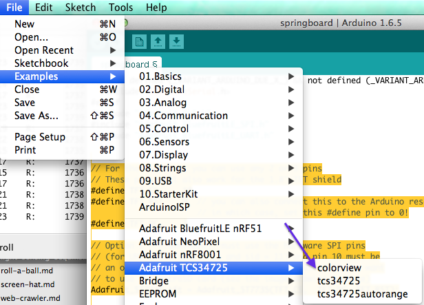



### Our other components

For this project we will also be using a few other components. The main one is a color sensor, which is simply a chip that can determine what color is in front of it. The other components are LED sequins, which are little collections of LEDs that can be made to display any color you want.

### Wiring up the sensor.

Now we get to wiring up some real hardware. You'll want to wire SDA to SDA, SCL to SCL, 3V to the 3.3v, and GND (ground)to GND. 

The SCL and SDA pins are used to handle serial data. SCL is the clock that sets how fast data transmits and SDA is the actual data line.

### Testing the code
In order to test the color sensor we'll need to install the library for it. Go to Sketch -> Include Library -> Manage Libraries, and search for TCS34725. There should be a matching Adafruit library online that you can install. 

Once you have installed the library, you should be able to run the example program, under File -> examples -> Adafruit TCS34725 -> colorview. Run the program, and open the serial monitor at Tools -> Serial Monitor. The sensor should be outputing RGB color values. You should be able to see the color values change as you put different colored objects in front of it, although this will work best with solid, brightly colored objects.

### Setting the onboard neopixel

To get a feel for using our neopixel sequins to match the color sensor, we're going to start by using the onboard neopixel. Luckily our sample code tries to do something pretty similar with LEDs, it just expects a different interface, but we can tweak our example code to talk to a neopixel instead. 

First save the example sketch. This will cause the Arduino IDE to prompt you where to save a copy of the sketch, so that you can have you own separate environment to work in.

Next we'll need to include the library. We've already downloaded it so all you'll really need to do is include the Adafruit_NeoPixel.h header into your header list so your headers. After adding it, the top headers of your file should look like this: 


#include <Wire.h>
#include "Adafruit_TCS34725.h"
#include <Adafruit_NeoPixel.h>



Next, we can delete all the code refering to 'redpin', 'greenpin', and 'bluepin', since we're not actually using separate wires out to LEDs in our program.

We're also going to want to set commonAnode to false instead of true. This variable determines whether the program should consider a high voltage value to be 'on', or a low voltage value to be 'on', which normally depends on the wiring of your LED. Luckily, our Neopixel doesn't deal with analog signals, so we can just set this value to 'false', which means that high values mean high light.


// for a common anode LED, connect the common pin to +5V
// for common cathode, connect the common to ground

// set to false if using a common cathode LED
#define commonAnode false



Now we can add the following lines to create an instance of our NeoPixel class

#define PIN 8

// The first parameter represents the number of Neopixels, the second is the pin.
// The third is the format of the data we send it.
Adafruit_NeoPixel strip = Adafruit_NeoPixel(1, PIN, NEO_GRB + NEO_KHZ800);



You should remember the above code snippet from earlier in the tutorial :)

Also, at the end of your setup function you can add the following lines to make sure the NeoPixel starts and switches its pixels off if they're not already.

  strip.begin();
  strip.show(); // Initialize all pixels to 'off' 


Finally, we need to actually set the colors. Get rid of all the "analogWrite" calls on "redpin", "bluepin". and "greenpin" and replace them with the following calls to set the color of our one Neopixel:


  strip.setPixelColor(0, 
      strip.Color(gammatable[(int)r], gammatable[(int)g], gammatable[(int)b])
  );
  strip.show();


The main interesting bit here is that we use the "gammatable" computed in the original example code. This exists because the values of R, G, and B that the sensor percieves do not necessarily match the color that would be output if those values were passed directly to LEDs. Instead, the program applies a correction factor to make the brighnesses bettter match. 

Phew, that was a lot of changes. After that, your final code should look like the following:


#include <Wire.h>
#include "Adafruit_TCS34725.h"
#include <Adafruit_NeoPixel.h>

// for a common anode LED, connect the common pin to +5V
// for common cathode, connect the common to ground

// set to false if using a common cathode LED
#define commonAnode false

// our RGB -> eye-recognized gamma color
byte gammatable[256];

#define PIN 8

// The first parameter represents the number of Neopixels.
// The second is the pin.
// The third is the format of the data we send it.
Adafruit_NeoPixel strip = Adafruit_NeoPixel(2, PIN, NEO_GRB + NEO_KHZ800);

Adafruit_TCS34725 tcs = 
    Adafruit_TCS34725(TCS34725_INTEGRATIONTIME_50MS, TCS34725_GAIN_4X);

void setup() {
  Serial.begin(9600);
  Serial.println("Color View Test!");

  if (tcs.begin()) {
    Serial.println("Found sensor");
  } else {
    Serial.println("No TCS34725 found ... check your connections");
    while (1) {
      Serial.println("busted");
      // halt!
    }
  }
  
  // thanks PhilB for this gamma table!
  // it helps convert RGB colors to what humans see
  for (int i=0; i<256; i++) {
    float x = i;
    x /= 255;
    x = pow(x, 2.5);
    x *= 255;
      
    if (commonAnode) {
      gammatable[i] = 255 - x;
    } else {
      gammatable[i] = x;      
    }
    //Serial.println(gammatable[i]);
  }

  strip.begin();
  strip.show(); // Initialize all pixels to 'off'
}

void loop() {
  uint16_t clear, red, green, blue;

  delay(60);  // takes 50ms to read 
  
  tcs.getRawData(&red, &green, &blue, &clear);

  Serial.print("C:\t"); Serial.print(clear);
  Serial.print("\tR:\t"); Serial.print(red);
  Serial.print("\tG:\t"); Serial.print(green);
  Serial.print("\tB:\t"); Serial.print(blue);

  // Figure out some basic hex code for visualization
  uint32_t sum = clear;
  float r, g, b;
  r = red; r /= sum;
  g = green; g /= sum;
  b = blue; b /= sum;
  r *= 256; g *= 256; b *= 256;
  Serial.print("\t");
  Serial.print((int)r, HEX); 
  Serial.print((int)g, HEX); 
  Serial.print((int)b, HEX);
  Serial.println();

  strip.setPixelColor(0, 
      strip.Color(gammatable[(int)r], gammatable[(int)g], gammatable[(int)b])
  );
  strip.show();
  
  delay(200);
}



Now we should can run the app and the color of the pixel on the Flora should match whatever we put in front of the sensor.

### Wiring the sequins

The NeoPixel is designed to be wired as a series of pixels, and the sequins are no exception. First chain two sequins along their arrow connectors with alligator clips, starting at pin D6 on the Flora. Then, wire both +s to the VBAtt (this represents the unregulated voltage from the power supply, which is 5V from USB and ~4.5 from batteries), and wire the - leads to GND. 

Next change PIN in the code to 6 to indicate that we will be outputing to pin 6, and set the number of pixels in the constructor to 2. 

Your code should now look like this: 


#define PIN 6

// The first parameter represents the number of Neopixels, the second is the pin.
// The third is the format of the data we send it.
Adafruit_NeoPixel strip = Adafruit_NeoPixel(2, PIN, NEO_GRB + NEO_KHZ800);


You will probably also want to modify the code to update both LEDs, so add another line after you set the first pixel to also set the second pixel at the end of your loop function. The code should now look like the following:


  strip.setPixelColor(0, strip.Color(gammatable[(int)r], gammatable[(int)g], gammatable[(int)b]));
  strip.setPixelColor(1, strip.Color(gammatable[(int)r], gammatable[(int)g], gammatable[(int)b]));
  strip.show();


### Sewing to the hat

Now that you have a working electrical circuit, you can turn it into a wearable. The next goal is to emulate that circuit with conductive thread. In order to do this, you'll need to place the screen on the front of the hat, and the flora positioned on the side of the hat. Then, for each wire from the original prototype, thread the wire through the wire hoop we created earlier, and stitch over to the corresponding plate on the Flora. Next, wrap the thread at least three times around both the hoop and the plate, and then tie it off and cut off any remaining loose thread.

After you stitch each thread, test the circuitry by running your program. That way you'll know which thread, if any, is problematic. Once all the thread is stitched and all the boards are attached, you can use a battery pack to power the devices for portability. 

#### Link to Adafruit 

Congratulations on your hack! if you want more ideas, Adafruit has tons of good example projects as well as documentation for how to implement them. Just go to [https://learn.adafruit.com/](https://learn.adafruit.com/) to learn more about different wearable and other microcontroller products.
